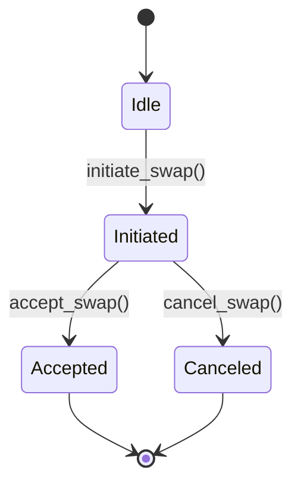
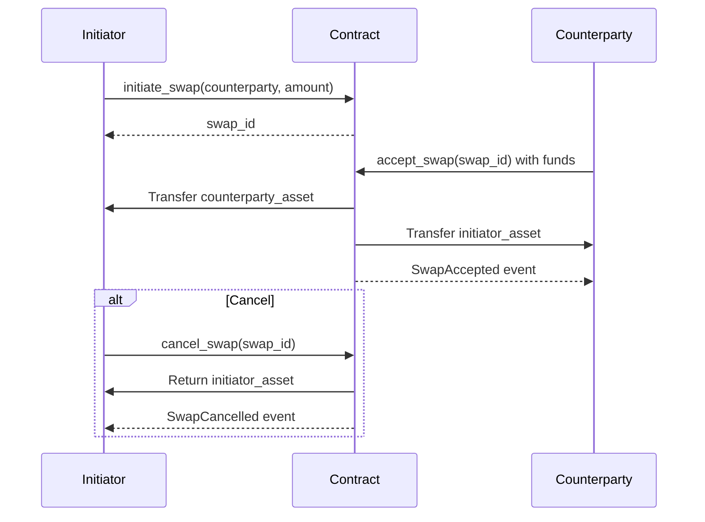

## A simple Asset Swap smart contract

This smart contract is designed to be used in a peer-to-peer exchange scenario where two parties agree to exchange assets. The contract ensures that the assets are locked up until it is accepted by the other party. At any point before it is accepted, one can cancel the swap to retrieve the assets.

This contract is just for academic purposes because of its limitations. It assumes that both parties are dealing with the same asset type. It lacks the ability to handle multiple asset types or interact with token standards (e.g., ERC-20 or PSP-22 for Polkadot).

### Key Features

| Feature | Description |
|---------|-------------|
| Atomic Swaps | Either both parties get their assets or the swap is canceled |
| Authorization Checks | Strict permission controls for swap operations |
| Reentrancy Protection | Prevents recursive call attacks |
| Event Logging | Track all swap lifecycle changes |
| Detailed Error Codes | Clear failure reasons for debugging |
| Storage Efficiency | Optimized mapping structure for swap storage |

### Data Structures

| Structure | Fields | Description |
|-----------|--------|-------------|
| `Swap` | initiator: AccountId counterparty: AccountId initiator_asset: Balance counterparty_asset: Balance | Represents a single swap agreement |
| `SwapContract` | swaps: Mapping<u32, Swap> next_swap_id: u32 reentrancy_guard: bool | Main contract storage with security features |

### Functions Overview

#### `initiate_swap()` - Creates new swap agreement

- **Key Points:**
  - Validate initiator's deposit > 0
  - Generate incremental swap ID
  - Store terms in mapping
  - Emit SwapInitiated event

#### `accept_swap()` - Execute asset exchange

- **Key Points:**
  - Activate reentrancy guard
  - Verify counterparty identity
  - Validate transferred amount
  - Transfer assets atomically
  - Clean storage & emit event

#### `cancel_swap()` - Abort swap and refund

- **Key Points:**
  - Verify initiator identity
  - Return locked funds
  - Remove swap record
  - Emit cancellation event

### State Diagram

### Sequence Diagram

